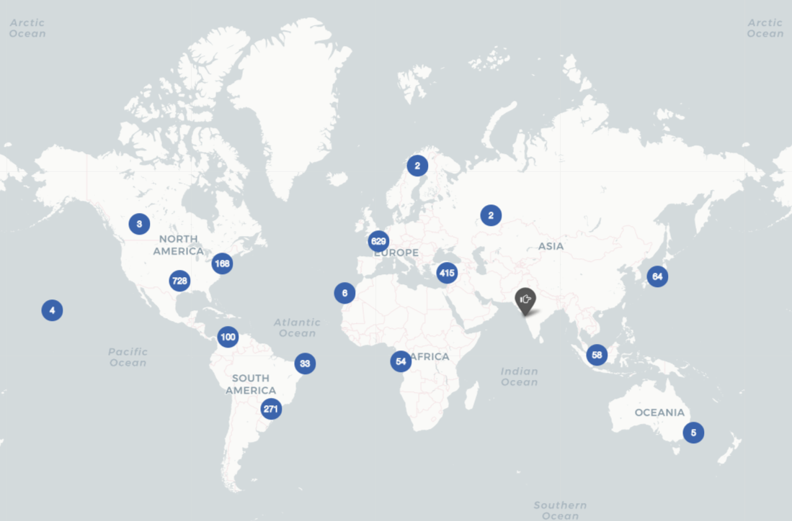
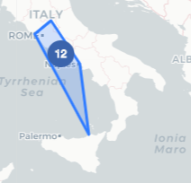
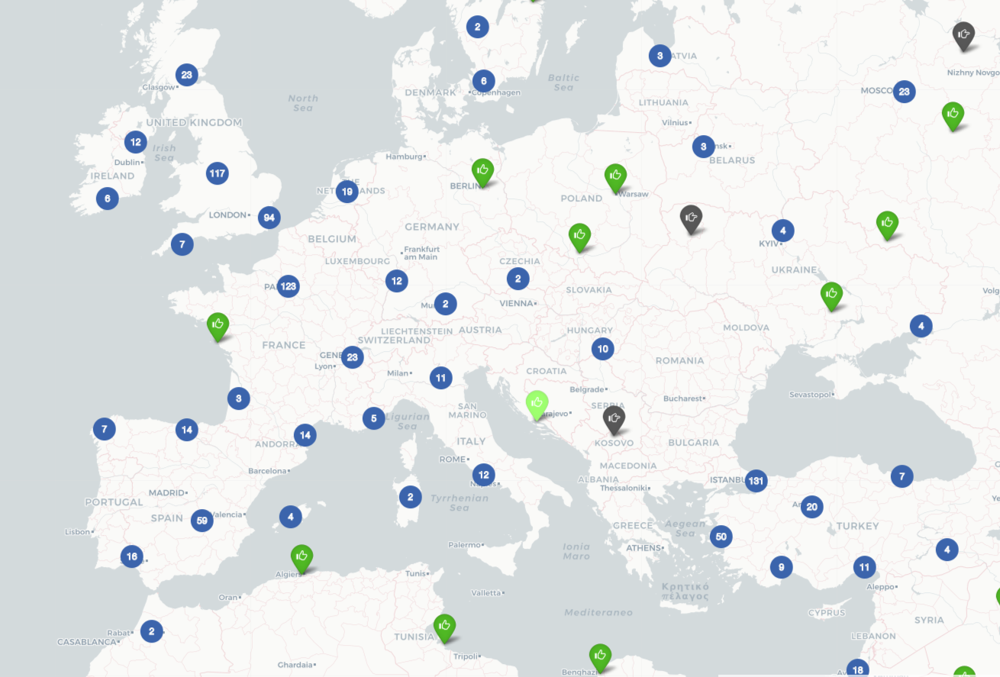
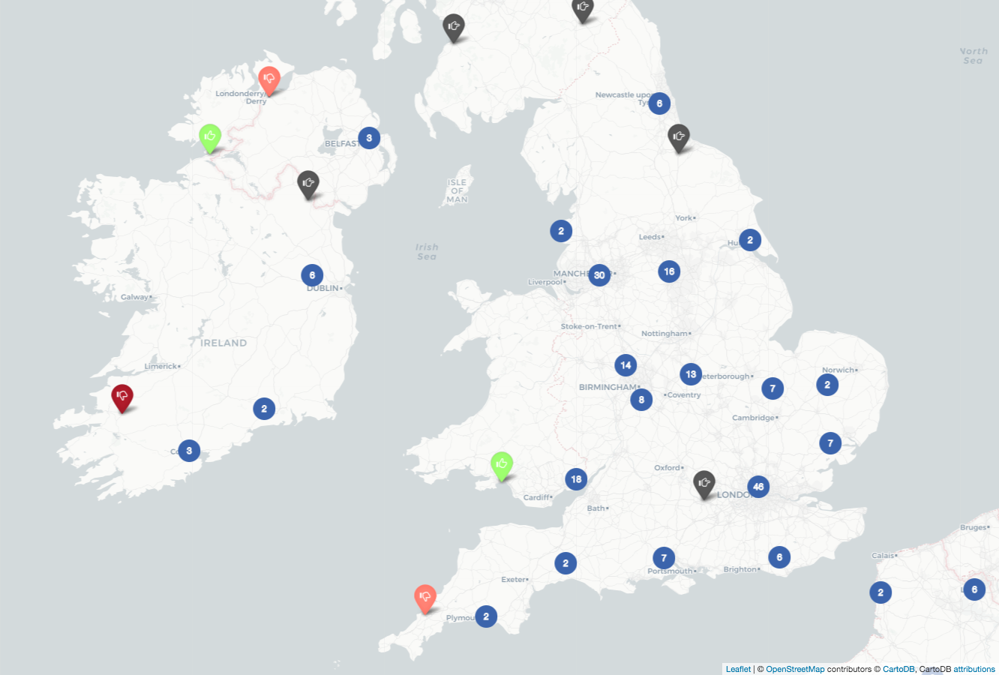
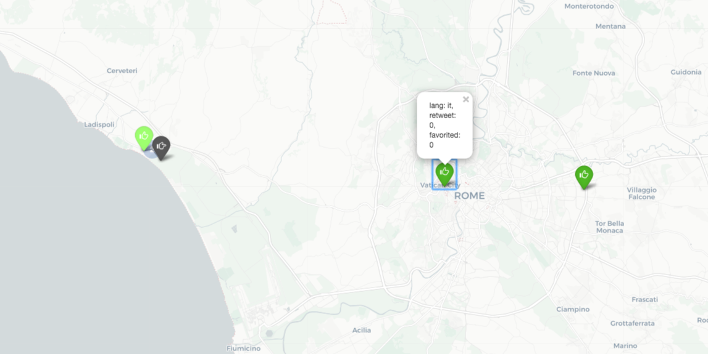
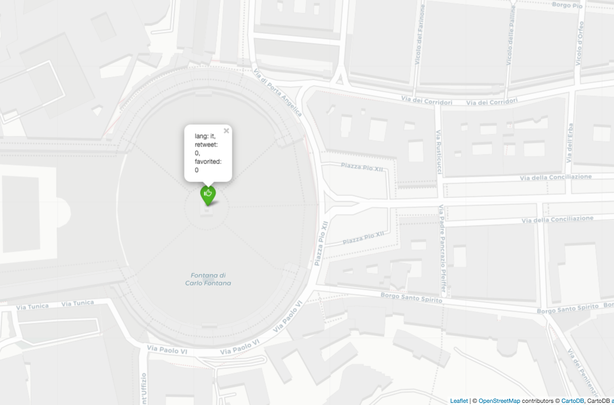

# DTC regione Lazio

Il Centro di Eccellenza del Distretto Tecnologico per le nuove tecnologie per i beni e le attività Culturali della regione Lazio
https://dtclazio.it/
  
Team sottoprogetto: Professor Riccardo Torlone e Alessio Zoccoli.

## Mappatura big data + sentiment analysis - app dimostrativa e statica
Utilizzando alcuni tweet [tweet](https://github.com/RyanMullins/Tutorial-LeafletMongoDB/blob/master/src/primer_tweets.json) si vogliono creare delle mappe geografiche che mettano in relazione flussi di dati provenienti dai social network e informazioni geospaziali.
Nelle mappe è possibile associare il colore dell'icona (a goccia) al sentimento espresso dal tweet: da rosso scuro per molto negativo a verde scuro per molto positivo, grigio qualora il sentimento sia neutro, il tweet non è soggettivo o il testo non è analizzabile.
Questo mini progetto è eseguito in locale, non comunica con il web (verrà poi portato tutto su Flask o Django).

Tecnologie:
- **Python**: 3.7
- **Folium** 0.9.1: creazione delle mappe
- **MongoDB** 4.0 (driver PyMongo 3.8.0): base di dati per i tweet
- **translate** 3.5.0: traduzione verso l'inglese di tutte le lingue (in futuro verrà aggiunto un modello specifico per l'italiano)
- **TextBlob** 0.15.2: per la sentiment analysis

## Screenshots:
In blu i cluster, questi sono etichettati dal numero di tweet al loro interno.
Clickando sui cluster:
- ci si avvicina (zoom automatico)
- il cluster viene scomposto nei tweet che lo formano.

Passandoci semplicemente sopra, un poligono delimiterà l'area che il cluster copre.
  
Il mongo intero.
  
Copertura del cluster vicino Roma. 

  
Europa: indicatori di colore verde scuro rappresentano tweet che esprimono sentimenti più positivi rispetto a quelli chiari

  
Irlanda e Regno Unito. Qui alcuni tweet esprimono sentimenti negativi o molto negativi.

  
Clickando su un indicatore vengono mostrati i seguenti dati relativi allo specifico tweet:
- lingua
- numero di retweet
- utenti che hanno apprezzato il tweet

  
Dettagli della mappa

